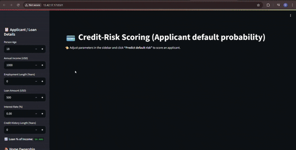

# 🏦 Credit Risk Modelling with CI/CD and DevOps Integration

## Description

This project presents a robust **Credit Risk Prediction System** that leverages **Machine Learning** to assess the likelihood of loan default by an applicant. It integrates **data preprocessing**, **EDA**, **modeling**, and **evaluation** within a streamlined pipeline. To simulate real-world deployment, we’ve employed **Docker**, deployed the app on an **AWS EC2 instance**, and integrated **GitHub Actions CI/CD pipelines** This enables financial institutions to make data-driven, risk-averse lending decisions..



---

## ⚙️ Technologies Used

### 💻 Programming & Libraries
- **Python 3.9+**
- **Pandas, NumPy** – Data processing
- **Matplotlib, Seaborn** – Visualization
- **Scikit-learn** – ML modeling and evaluation
- **Joblib** – Model serialization

### 🐳 DevOps & MLOps Tools
- **Docker** – Containerization
- **GitHub Actions** – CI/CD pipeline
- **AWS EC2 (Amazon Linux)** – Cloud deployment
- **Git** – Version control
- **Kubernetes (future support)** – For container orchestration
- **YAML** – For CI/CD workflows & Kubernetes manifests

---

## 📊 Dataset Description

- **File**: `credit_risk_dataset.csv`
- **Size**: ~1 MB
- **Columns**: Includes `age`, `income`, `loan_amount`, `credit_score`, `employment_status`, etc.
- **Target**: `loan_status` (1 for default risk, 0 for no default)

---

## Project Workflow

### 1️⃣ Data Preprocessing

- Missing value treatment using mean/mode imputation
- Encoding categorical variables (Label Encoding / One-Hot Encoding)
- StandardScaler used for numerical feature scaling
- Loan Grade Insight:
  - C to G loan grades were used to classify the creditworthiness.
  - C = Lowest risk, G = Highest risk.
  - These were encoded appropriately for ML models.

### 2️⃣ Exploratory Data Analysis (EDA)

- Univariate and bivariate plots for insights
- Correlation heatmaps
- Class imbalance identification
  

### 3️⃣ Model Training & Evaluation

- Models: **Logistic Regression**, **Decision Tree**, **Random Forest**
- Evaluated using:
  - Accuracy
  - Precision, Recall, F1-Score
  - ROC-AUC Curve
- Cross-validation used for robustness

### 4️⃣ Model Serialization

- Best-performing model serialized using `joblib`
- Stored as `model.pkl`

---

## 🚀 Web App Deployment

### 🖥️ Frontend

- Developed with **Streamlit**
- Allows users to input features and get real-time credit risk prediction

---

### 🐳 Dockerization

```Dockerfile
FROM python:3.9-slim
WORKDIR /app
COPY . .
RUN pip install --no-cache-dir -r requirements.txt
CMD ["streamlit", "run", "app.py", "--server.port=8501", "--server.address=0.0.0.0"]
```

### 💡 Docker Commands
```
docker build -t credit-risk-ui .
docker run -d -p 8501:8501 --name credit-app credit-risk-ui
```

---

## ☁️ AWS EC2 Deployment
- OS: Amazon Linux 2023
- Docker installed and service enabled
- GitHub Actions used for automated CI/CD deployment

---

## 📦 GitHub Actions Workflow (CI/CD)
```
on:
  push:
    branches:
      - main

jobs:
  deploy:
    runs-on: ubuntu-latest
    steps:
      - uses: actions/checkout@v3
      - uses: webfactory/ssh-agent@v0.8.0
        with:
          ssh-private-key: ${{ secrets.EC2_SSH_KEY }}
      - run: |
          ssh -tt deploy@<ec2-ip> << 'EOF'
            cd ~/Credit_Risk_Modelling/credit-risk
            git pull origin main
            docker stop credit-app || true && docker rm credit-app || true
            docker rmi -f credit-risk-ui:latest || true
            docker build -t credit-risk-ui .
            docker run -d -p 8501:8501 --name credit-app credit-risk-ui
          EOF
```
- ✅ Triggered on each main push.
- ✅ Automatically rebuilds the Docker image.
- ✅ Removes the old container/image before redeployment.

---

## 🧱 Software Architecture
- Microservices-style (frontend container + model container planned)
- Single-container setup (monolith) currently
- Future Kubernetes setup for scalability and rolling updates

---

## 🧭 Kubernetes Ready
- deployment.yaml defines pod spec for credit-risk-ui
- service.yaml exposes pod via ClusterIP / NodePort

---

## 📸 Model Performance Visualization


---

## 🌐Live Deployment on EC2 Instance 
[Click here to test the new deployed model](http://13.42.17.17:8501/)

---

## 👨‍💻 Industry Practices Followed
- ✅ CI/CD pipeline with rollback capability.
- ✅ Containerization for reproducibility
- ✅ Infrastructure-as-Code (Docker, Kubernetes YAMLs)
- ✅ Code modularity & readability

---


## Installation


To set up the project locally:

1. **Clone the Repository**:
   ```bash
   git clone https://github.com/VatsalSangani/Credit_Risk_Modelling.git
