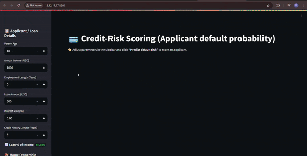

# Credit Risk Modelling

A production-grade credit risk prediction system that assesses the probability of loan default using a Gradient Boosting Machine (GBM). The system is served through a FastAPI backend and a Streamlit frontend, deployed on **GCP Cloud Run** with infrastructure provisioned via **Terraform**.

Previously deployed on AWS EC2 via GitHub Actions CI/CD. Migrated to GCP Cloud Run for serverless scaling and zero idle cost.

---

## 🚀 Live Demo

**[credit-risk-646227725228.europe-west2.run.app](https://credit-risk-646227725228.europe-west2.run.app)**

> First load takes ~1 minute (cold start)



Fill in the applicant details in the sidebar and click **Predict default risk** to get a probability score and risk classification.

---

## How It Works

```
Applicant Details (Streamlit UI)
           │
           ▼
┌─────────────────────────────────┐
│  Feature Engineering            │
│  · One-hot encode home          │
│    ownership, loan intent,      │
│    loan grade                   │
│  · Derive loan_percent_income   │
│    = loan_amount / income × 100 │
└──────────────┬──────────────────┘
               │
               ▼
┌─────────────────────────────────┐
│  FastAPI Backend (:8000)        │
│  POST /predict                  │
│  · Validates input schema       │
│  · Aligns 22 features           │
│  · Returns probability + label  │
└──────────────┬──────────────────┘
               │
               ▼
┌─────────────────────────────────┐
│  GBM Model (LightGBM)           │
│  · Trained on credit_risk       │
│    dataset (32.5K applicants)   │
│  · 22 features                  │
│  · Output: P(default)           │
└─────────────────────────────────┘
```

---

## Model

### Algorithm
Gradient Boosting Machine (LightGBM) — chosen for its strong performance on tabular financial data with class imbalance.

### Features (22 total)

| Feature | Type | Description |
|---|---|---|
| `person_age` | Numeric | Applicant age |
| `person_income` | Numeric | Annual income (USD) |
| `person_emp_length` | Numeric | Employment length (years) |
| `loan_amnt` | Numeric | Requested loan amount (USD) |
| `loan_int_rate` | Numeric | Interest rate (%) |
| `loan_percent_income` | Derived | Loan amount as % of income |
| `cb_person_cred_hist_length` | Numeric | Credit history length (years) |
| `person_home_ownership_*` | One-hot | OWN, RENT, OTHER |
| `loan_intent_*` | One-hot | EDUCATION, HOMEIMPROVEMENT, MEDICAL, PERSONAL, VENTURE |
| `loan_grade_*` | One-hot | B through G (C=lower risk, G=highest risk) |
| `cb_person_default_on_file_Y` | Binary | Prior default on record |

### Target
`loan_status`: 1 = default risk, 0 = likely safe

### Evaluation Metrics
- Accuracy
- Precision, Recall, F1-Score
- ROC-AUC

---

## Project Structure

```
Credit_Risk_Modelling/
├── credit-risk/
│   ├── app/
│   │   ├── main.py          # FastAPI backend — /predict endpoint
│   │   └── app.py           # Streamlit frontend
│   ├── artifacts/
│   │   ├── gbm_credit_risk_model.pkl   # Trained GBM model
│   │   └── gbm_features.json           # Feature names for alignment
│   ├── Dockerfile           # GCP Cloud Run deployment
│   ├── entrypoint.sh        # Starts FastAPI + Streamlit
│   └── requirements.txt     # Pinned Python dependencies
├── terraform/
│   ├── main.tf              # Azure App Service F1 + Resource Group
│   ├── variables.tf         # Subscription ID, region, app name
│   └── outputs.tf           # App URL output
├── k8s/
│   ├── deployment.yaml      # Kubernetes pod spec
│   └── service.yaml         # ClusterIP/NodePort service
├── .github/workflows/
│   └── deploy.yml           # CI/CD pipeline
└── .archive/
    ├── credit_risk_modelling.ipynb     # Training notebook
    └── Model Comparison Results.png   # Model evaluation charts
```

---

## API

### `POST /predict`

**Request:**
```json
{
  "person_age": 30,
  "person_income": 55000,
  "person_emp_length": 5,
  "loan_amnt": 10000,
  "loan_int_rate": 12.5,
  "cb_person_cred_hist_length": 4,
  "person_home_ownership_RENT": 1,
  "loan_intent_PERSONAL": 1,
  "loan_grade_C": 1
}
```

**Response:**
```json
{
  "prediction": 0,
  "probability": 0.1234
}
```

`prediction`: 0 = likely safe, 1 = high default risk

`probability`: probability of default (0.0 → 1.0)

### `GET /`
Health check — returns `{"status": "ok"}`

---

## Infrastructure

### Current: GCP Cloud Run (Serverless)

```
GitHub Repo
    │
    ▼
GCP Cloud Build (builds Dockerfile)
    │
    ▼
GCP Cloud Run
  · python:3.11-slim
  · FastAPI on :8000 (internal)
  · Streamlit on :8501 (public)
  · 1GB RAM, 1 vCPU
  · min-instances: 0 (scales to zero when idle)
  · region: europe-west2
```

Deploy command:
```bash
gcloud run deploy credit-risk \
  --source ./credit-risk \
  --port 8501 \
  --memory 1Gi \
  --cpu 1 \
  --region europe-west2 \
  --allow-unauthenticated \
  --min-instances 0 \
  --max-instances 1 \
  --timeout 300 \
  --clear-base-image
```

### IaC: Terraform for Azure App Service F1

Terraform configuration in `terraform/` provisions:
- Azure Resource Group
- App Service Plan (F1 — free tier)
- Linux Web App (Python 3.11)

```bash
cd terraform
terraform init
terraform plan
terraform apply
```

> Note: Azure F1 free tier has regional quota restrictions on new accounts. The Terraform code is production-ready; deployment was blocked by Azure's `Current Limit (Total VMs): 0` restriction in available regions.

### Previous: AWS EC2 via GitHub Actions

Originally deployed on AWS EC2 (Amazon Linux) with GitHub Actions CI/CD — automated Docker build and deploy on every push to main.

---

## Local Setup

```bash
git clone https://github.com/VatsalSangani/Credit_Risk_Modelling.git
cd Credit_Risk_Modelling/credit-risk

pip install -r requirements.txt

# Terminal 1 — FastAPI backend
uvicorn app.main:app --host 0.0.0.0 --port 8000

# Terminal 2 — Streamlit frontend
streamlit run app/app.py --server.port 8501
```

Open **http://localhost:8501**

---

## Tech Stack

| Component | Technology |
|---|---|
| Model | LightGBM (GBM) |
| Backend | FastAPI |
| Frontend | Streamlit |
| Containerisation | Docker (python:3.11-slim) |
| Current deployment | GCP Cloud Run |
| IaC | Terraform (Azure App Service F1) |
| Previous deployment | AWS EC2 + GitHub Actions CI/CD |
| Orchestration (ready) | Kubernetes (k8s/ manifests included) |
| Language | Python 3.11 |

---

## Cloud Coverage

| Cloud | Service | Status |
|---|---|---|
| GCP | Cloud Run | ✅ Live |
| Azure | App Service F1 via Terraform | 📄 IaC ready, blocked by quota |
| AWS | EC2 + GitHub Actions | ✅ Previously deployed |

---

## What I'd Do Next

1. **SHAP explanations** — Add force plots for individual predictions (placeholder already in UI)
2. **Model monitoring** — Track prediction drift and data drift in production
3. **Full Azure deployment** — Request quota increase for App Service F1 in a supported region
4. **A/B model comparison** — Compare GBM vs XGBoost vs Logistic Regression in production
5. **Input validation** — Add stricter business rules (e.g. age limits, income thresholds)

---

## License

Portfolio and educational use. Dataset sourced from Kaggle credit risk datasets.